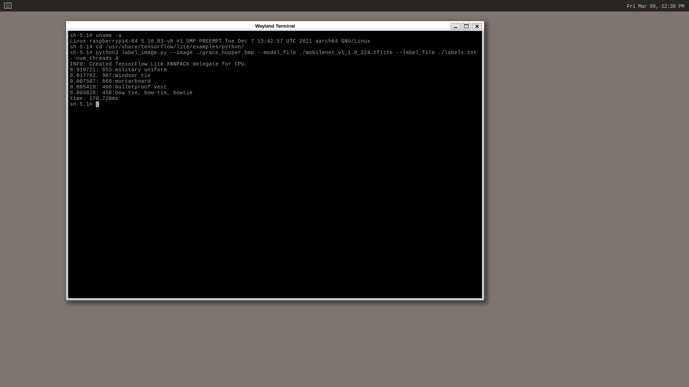

# TensorFlow Lite Python image classification demo

## Reference

- [TensorFlow Lite Python image classification demo - tensorflow/tensorflow](https://github.com/tensorflow/tensorflow/blob/v2.8.0/tensorflow/lite/examples/python/README.md)

## How to
Build sample on Raspberry Pi 4 AArch64 (core-image-weston).

### Clone repositories and oe-init-build-env.
```
git clone git://git.yoctoproject.org/poky.git
git clone git://git.yoctoproject.org/meta-raspberrypi
git clone git://git.openembedded.org/meta-openembedded
git clone https://github.com/NobuoTsukamoto/meta-tensorflow-lite.git
source poky/oe-init-build-env build
```

### Add layer
```
bitbake-layers add-layer ../meta-openembedded/meta-oe/
bitbake-layers add-layer ../meta-openembedded/meta-python/
bitbake-layers add-layer ../meta-openembedded/meta-networking/
bitbake-layers add-layer ../meta-openembedded/meta-multimedia/
bitbake-layers add-layer ../meta-raspberrypi/
bitbake-layers add-layer ../meta-tensorflow-lite/
```

### Create conf/auto.conf file and write config
Add `python3-tensorflow-lite`, `python3-tensorflow-lite-example` and `python3-pillow` recipes to `conf/auto.conf` file.
```
FORTRAN:forcevariable = ",fortran"
IMAGE_INSTALL:append = " python3-tensorflow-lite-example"
```

### Bitbake
```
MACHINE=raspberrypi4-64 bitbake core-image-weston
```

### Write image
Write image to micro-SD card.

### Boot Raspberry Pi
Power on your Raspberry Pi.

### Run example.
Launch a terminal and run the example.
```
cd /usr/share/tensorflow/lite/examples/python/
python3 label_image.py \
  --image ./grace_hopper.bmp \
  --model_file ./mobilenet_v1_1.0_224.tflite \
  --label_file ./labels.txt
```

The following results can be obtained.
```
0.919721: 653:military uniform
0.017762: 907:Windsor tie
0.007507: 668:mortarboard
0.005419: 466:bulletproof vest
0.003828: 458:bow tie, bow-tie, bowtie
time: 369.129ms
```


## Code changes
The original code imports `tensorflow`. I am changing this to import `tflite_runtime.interpreter`. This has been modified to work with TensorFlow Lite.  
See below for changes to the original code.
- [001-v2.8_label_image_py.patch](recipes-examples/tensorflow-lite/python/files/001-v2.8_label_image_py.patch)
