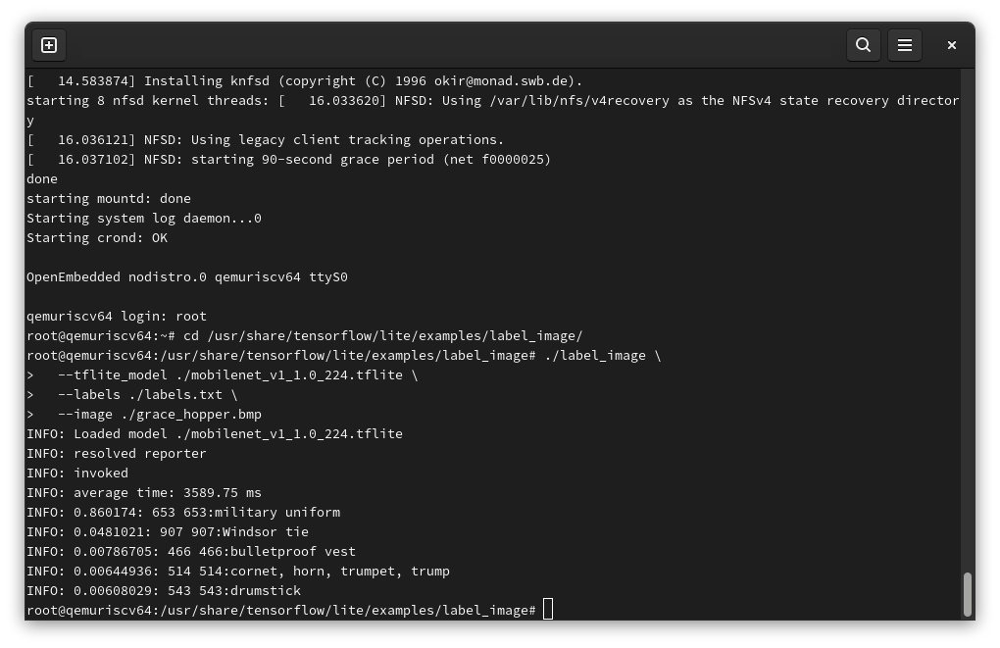

# TensorFlow Lite C++ image classification demo

## Reference

- [TensorFlow Lite C++ image classification demo - tensorflow/tensorflow](https://github.com/tensorflow/tensorflow/blob/v2.8.0/tensorflow/lite/examples/label_image/README.md)

## How to
Build sample on qemueriscv64 (core-image-full-cmdline).

### Clone repositories and oe-init-build-env.
```
git clone https://github.com/openembedded/bitbake.git
git clone https://github.com/openembedded/openembedded-core.git
git clone https://github.com/openembedded/meta-openembedded.git
git clone https://github.com/riscv/meta-riscv.git
git clone https://github.com/NobuoTsukamoto/meta-tensorflow-lite.git
source openembedded-core/oe-init-build-env build
```

### Add layer
```
bitbake-layers add-layer ../meta-openembedded/meta-oe/
bitbake-layers add-layer ../meta-openembedded/meta-python/
bitbake-layers add-layer ../meta-openembedded/meta-networking/
bitbake-layers add-layer ../meta-openembedded/meta-multimedia/
bitbake-layers add-layer ../meta-riscv/
bitbake-layers add-layer ../meta-tensorflow-lite/
```

### Create conf/auto.conf file and write config
Add `tensorflow-lite-label-image` recipes to `conf/auto.conf` file.
```
FORTRAN:forcevariable = ",fortran"
IMAGE_INSTALL:append = " tensorflow-lite-label-image"
```

### Bitbake
```
MACHINE=qemuriscv64 bitbake core-image-full-cmdline
```

### Run QEMU
```
MACHINE=qemuriscv64 runqemu nographic
```

### Run example.
login `root` and run the example.
```
cd /usr/share/tensorflow/lite/examples/label_image/
./label_image \
  --tflite_model ./mobilenet_v1_1.0_224.tflite \
  --labels ./labels.txt \
  --image ./grace_hopper.bmp 
```

The following results can be obtained.
```
INFO: Loaded model ./mobilenet_v1_1.0_224.tflite
INFO: resolved reporter
INFO: invoked
INFO: average time: 3980.43 ms
INFO: 0.860174: 653 653:military uniform
INFO: 0.0481021: 907 907:Windsor tie
INFO: 0.00786705: 466 466:bulletproof vest
INFO: 0.00644936: 514 514:cornet, horn, trumpet, trump
INFO: 0.00608029: 543 543:drumstick
```


## Code changes
The original sample CMake statically links tensorflow-lite.
In this recipe, we will modify CMake to link the shared library (libtensorflow-lite.so) and change the include path of the header file so that it can be built independently.  

For more information about the changes in CMake and source, please refer to the following patch.
- [001-v2.8_label_image_cpp.patch](../recipes-examples/tensorflow-lite/files/001-v2.8_label_image_cpp.patch)

See [libtensorflow-lite](../recipes-framework/tensorflow-lite/libtensorflow-lite_2.8.0.bb) for a recipe to build a shared library for libtensorflow-lite.so.
