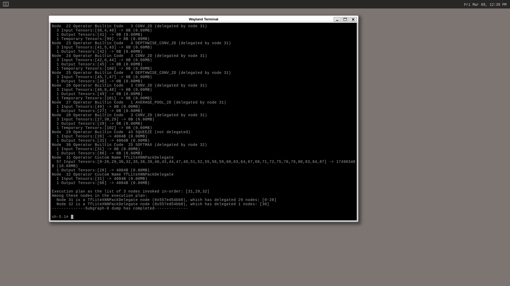

# TensorFlow Lite C++ minimal example

## Reference

- [TensorFlow Lite C++ minimal example - tensorflow/tensorflow](https://github.com/tensorflow/tensorflow/blob/v2.8.0/tensorflow/lite/examples/minimal/README.md)

## How to
Build sample on Raspberry Pi 4 AArch64 (core-image-weston).

### Clone repositories and oe-init-build-env.
```
git clone git://git.yoctoproject.org/poky.git
git clone git://git.yoctoproject.org/meta-raspberrypi
git clone git://git.openembedded.org/meta-openembedded
git clone https://github.com/NobuoTsukamoto/meta-tensorflow-lite.git
source poky/oe-init-build-env build
```

### Add layer
```
bitbake-layers add-layer ../meta-openembedded/meta-oe/
bitbake-layers add-layer ../meta-openembedded/meta-python/
bitbake-layers add-layer ../meta-openembedded/meta-networking/
bitbake-layers add-layer ../meta-openembedded/meta-multimedia/
bitbake-layers add-layer ../meta-raspberrypi/
bitbake-layers add-layer ../meta-tensorflow-lite/
```

### Create conf/auto.conf file and write config
Add `tensorflow-lite-minimal` recipes to `conf/auto.conf` file.
```
FORTRAN:forcevariable = ",fortran"
IMAGE_INSTALL:append = " tensorflow-lite-minimal"
```

### Bitbake
```
MACHINE=raspberrypi4-64 bitbake core-image-weston
```

### Write image
Write image to micro-SD card.

### Boot Raspberry Pi
Power on your Raspberry Pi.

### Run example.
Launch a terminal and run the example.
```
cd /usr/share/tensorflow/lite/examples/minimal/
./minimal ./mobilenet_v1_1.0_224.tflite
```

The following results can be obtained.
```
=== Pre-invoke Interpreter State ===
Interpreter has 1 subgraphs.

...

Execution plan as the list of 3 nodes invoked in-order: [31,29,32]
Among these nodes in the execution plan:
  Node 31 is a TfLiteXNNPackDelegate node (0x556d72abb0), which has delegated 29 nodes: [0-28]
  Node 32 is a TfLiteXNNPackDelegate node (0x556d72abb0), which has delegated 1 nodes: [30]
--------------Subgraph-0 dump has completed--------------
```


## Code changes
The original sample CMake statically links tensorflow-lite.
In this recipe, we will modify CMake to link the shared library (libtensorflow-lite.so) so that it can be built independently.  

For more information about the changes in CMake, please refer to the following patch.
- [001-v2.8_minimal_cmake.patch](../recipes-examples/tensorflow-lite/files/001-v2.8_minimal_cmake.patch)

See [libtensorflow-lite](../recipes-framework/tensorflow-lite/libtensorflow-lite_2.8.0.bb) for a recipe to build a shared library for libtensorflow-lite.so.